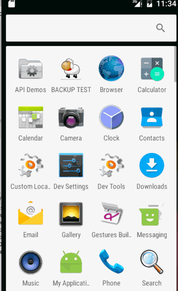

RapplingView

涟漪动画View

效果图:

使用方式:

​	<帧布局>

​	<你的布局 />

​	<涟漪动画View />

​	</帧布局>

具体申明代码:

        <com.gloomyer.rippling.RipplingView
        	android:visibility="invisible" 
        	android:layout_width="match_parent"
        	android:layout_height="match_parent" />
这里加上visibility=invisible,是为了你在预览修改你的界面的时候方便,Rappling会自动在程序启动的时候修改visibility=visible.